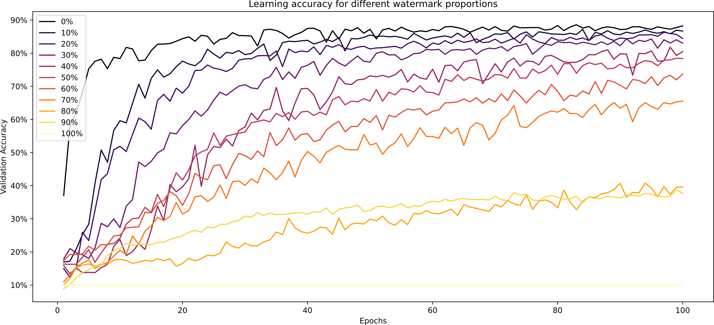
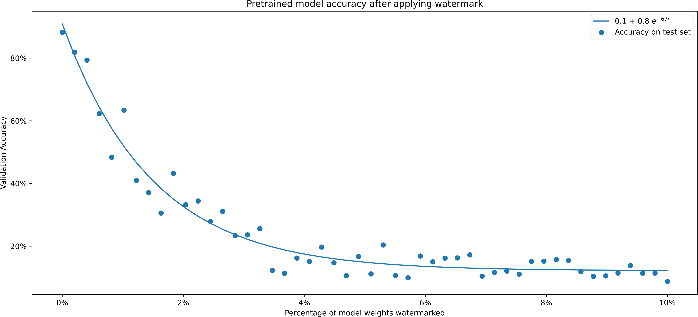
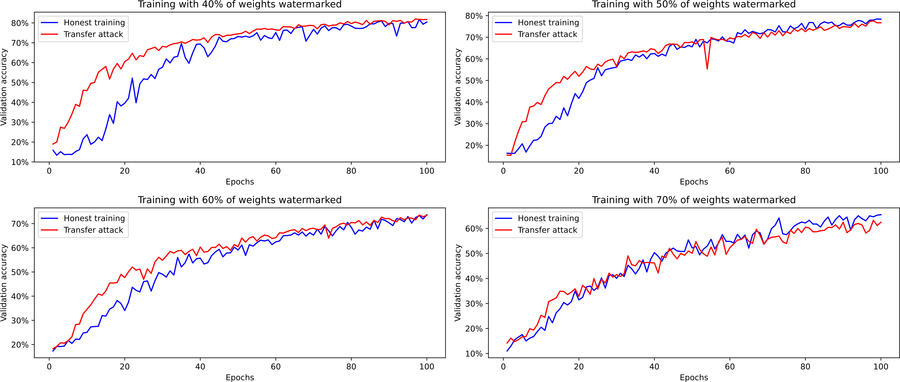

# FreezeNet

FreezeNet is an attempt at making Proof of Work more computationally useful than it currently is. The idea is to replace [Hashcash](http://www.hashcash.org/)-like challenges with neural network training. This is not a fully-implemented alternative but only a proof of concept which was presented for a Data Mining project at the University of Stavanger. However, the results are encouraging so it seems worth sharing. Pull requests, questions and criticism are welcome.

The paper explaning this project in more detail will be available by the end of April.

## Simple API

You can apply a watermark to a model at any point.

```python
model = FreezeNet()

some_signature    = Signature(b'Some block information', 4096)
another_signature = Signature(b'Some other block information', 4096)

some_signature.sign(model)

some_signature.verify(model)    # True
another_signature.verify(model) # False

another_signature.sign(model)

some_signature.verify(model)    # False
another_signature.verify(model) # True
```

You can also train a model with a watermark.

```python
model = FreezeNet()
some_signature = Signature(b'Some block information', 4096)
model.fit(x_train, y_train, **train_parameters, signature=some_signature)
```


## Learning ability



## Weak tampering resistance



## Strong tampering resistance

